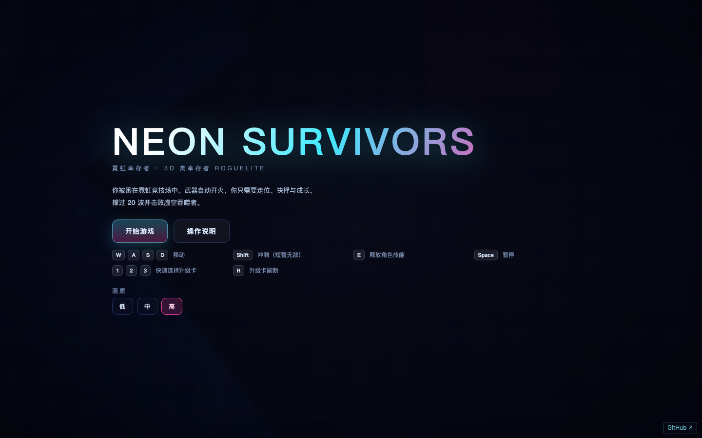

# NEON SURVIVORS · 霓虹幸存者

3D 俯视角「类幸存者」自动战斗 Roguelite，纯浏览器运行。你只负责走位，武器自动开火。



## 在线游玩

- **GitHub Pages**：https://holynova.github.io/neon-survivors/
- **GitHub Repo**：https://github.com/holynova/neon-survivors


## 本地运行

```bash
npm install
npm run dev        # http://localhost:5180
npm run build      # 产出 dist/
npm test           # 单元 + e2e 测试
```

## 玩法

- 20 波战斗，每 5 波一个 BOSS，终局为「虚空吞噬者」
- 5 个角色、8 把武器，各有独立机制与主动技能
- 击杀掉落经验宝珠，升级三选一强化卡，波间开放补给商店
- 操作：`WASD` 移动，`Shift` 冲刺，`E` 技能，`Space` 暂停

## 技术

Vite + Three.js，零外部资源依赖（模型程序化生成、音效 Web Audio 合成）。逻辑层与渲染层分离，113 项单元测试 + 17 项 e2e 测试。
