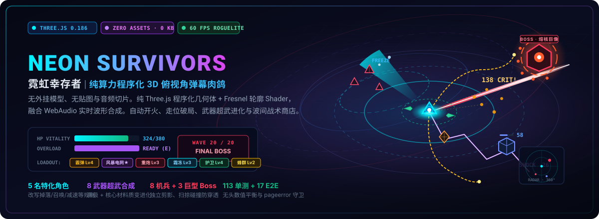
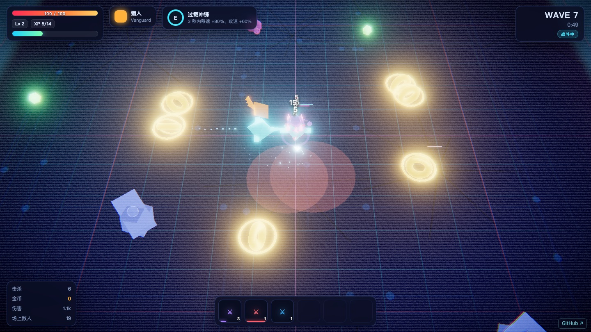

<p align="center">
  
</p>

<p align="center">
  <a href="https://holynova.github.io/neon-survivors/"></a>
  <a href="https://threejs.org/"></a>
  <a href="https://vite.dev/"></a>
  
  
  <a href="./LICENSE"></a>
</p>

---

## ⚡ 核心亮点 (Highlights)

**霓虹幸存者（Neon Survivors）** 是一款运行在现代浏览器中的 **3D 俯视角类幸存者（Survivor-like）Roguelite 竞技场**。

- 💎 **零外部资源 (Zero External Assets)**：无任何 `.glb` 模型、无 `.png` 贴图、无 `.mp3` 音频文件。全量几何体纯 Three.js 程序化生成，音效由 WebAudio 实时波形合成。
- 🔮 **自研 Fresnel 轮廓 Shader**：针对纯俯视角环境与暗色网格地面，定制视线法线边缘辉光，确保纯色几何体在混乱弹幕中仍保持锐利剪影。
- 🛡️ **扫掠碰撞 (Swept AABB/Circle)**：防穿透算法，根除超高速重炮弹丸穿透小型敏捷怪物的漏判缺陷。
- ⏱️ **顿帧打击感 (Hitstop & Slow-mo)**：固定步长主循环驱动 `timeScale`，暴击与重型爆炸时触发即时帧定格与电影级慢镜。
- 🎆 **6 池 GPU 粒子系统**：Bloom 辉光、色差畸变、冲击波扩散环、折线闪电电弧，全部依托 `InstancedMesh` 与内存对象池，60 FPS 丝滑无卡顿。

---

## 🎮 在线试玩 (Play Online)

<p align="center">
  <a href="https://holynova.github.io/neon-survivors/"><strong>👉 立即在浏览器畅玩：holynova.github.io/neon-survivors 👈</strong></a>
</p>

<p align="center">
  <br>
  <em>手机或平板扫码即可直接体验 WebGL 渲染</em>
</p>

<p align="center">
  
</p>

---

## 🕹️ 操作与视角指南 (Controls)

| 按键 / 操作 | 功能说明 | 战术提示 |
|:---|:---|:---|
| <kbd>W</kbd> <kbd>A</kbd> <kbd>S</kbd> <kbd>D</kbd> / 方向键 | 控制角色全向移动 | 自动朝向行进方向或最近敌人 |
| <kbd>Shift</kbd> | 战术冲刺 (Dash) | 获得短暂爆发位移，突破敌群包围 |
| <kbd>E</kbd> | 角色专属主动大招 | 充能完毕后释放，扭转危急战局 |
| <kbd>Space</kbd> | 暂停 / 继续游戏 | 随时查看当前面板状态与武器数值 |
| <kbd>1</kbd> / <kbd>2</kbd> / <kbd>3</kbd> | 升级时快速选卡 | 亦可直接通过鼠标点击卡片确认 |
| **鼠标全自动** | 武器全自动瞄准 | 优先索敌射程内最近或威胁度最高的目标 |

---

## 👤 5 大特化角色 (Characters)

每个角色不仅具备独特的属性倾向，更自带**专属战术规则重构**与**专属技能**：

| 角色 | 初始武器 | 战术特性 | 核心改写规则 | 专属主动技能 |
|:---|:---|:---|:---|:---|
| **猎人 (Vanguard)** | 霰弹枪 | 均衡近身爆发 | 击杀有 15% 概率额外掉落金币，近距暴击率强化 | **过载冲锋**：3 秒内移速 +80%、攻速 +60% |
| **工程师 (Engineer)** | 脉冲机枪 | 阵地火力网 | 每击杀 5 名敌人自动召唤 1 架巡航无人机（上限 4） | **部署信标**：原地投掷持续 6 秒的纳米治疗信标 |
| **爆破手 (Demolitionist)** | 榴弹发射器 | 范围群体歼灭 | 全局爆炸半径 +35%，爆炸击杀额外获得 +30% 经验 | **集束装药**：向前方快速连发 5 枚高爆集束炸弹 |
| **电刑者 (Arcwelder)** | 特斯拉线圈 | 连锁感电控场 | 闪电弹跳次数 +2，命中敌人附带高压麻痹硬直 | **电网过载**：全场敌人瞬间感电 2.5 秒并受到持续雷击 |
| **霜蚀者 (Cryomancer)** | 霜冻喷枪 | 极寒减速风筝 | 攻击使敌减速 45%，移动路径留下冰霜足迹 | **绝对零度**：半径 12 码极寒领域，冻结全部目标 3 秒 |

---

## ⚔️ 8 种武器与超武进化 (Weapons & Evolution)

游戏中武器分为 4 个阶级（Tier），满级（Lv.4）搭配核心材料可在商店或升级时完成**超武进化（Evolve）**：

| 基础武器 | 伤害类型 | 弹道机理 | 满级超武形态 | 进化质变效果 |
|:---|:---|:---|:---|:---|
| **霰弹枪 (Scatter)** | 动能 | 扇形多发锥面散射，每发独立计算暴击 | **爆裂霰弹枪** | 弹丸数量剧增，破甲碎裂并附带大范围击退 |
| **脉冲机枪 (Pulse SMG)** | 动能 | 极高初速单体连发，射速持续攀升 | **脉冲加特林** | 极速弹幕洪流，自带多重贯穿属性 |
| **特斯拉线圈 (Tesla)** | 电弧 | 命中跳跃至周围目标，伤害逐次衰减 | **风暴电网** | 弹跳上限倍增，全链路附加电浆麻痹 |
| **榴弹发射器 (Grenade)** | 火焰 | 抛物线重炮，落地引信引爆大范围火海 | **集束爆轰** | 落地二段裂变为多枚子母高爆雷 |
| **霜冻喷枪 (Frost Lance)** | 冰霜 | 持续锥形粒子冷气流，极速减速风筝 | **绝对零域** | 形成常驻极寒冰霜旋涡，彻底阻断近战突进 |
| **轨道护卫 (Orbital Guard)** | 动能 | 环绕身侧旋转切割，转速即为输出频率 | **卫星阵列** | 扩充至 4+ 核心卫星，兼具防御弹幕与强击退 |
| **狙击重炮 (Railgun)** | 电弧 | 极长蓄力贯穿电磁光矛，全屏贯通 | **歼星重锤** | 无视目标数量贯穿全场，末端爆轰 |
| **蜂群飞弹 (Swarm Missiles)** | 火焰 | 自动雷达锁定追踪弹，曲率机动命中 | **饱和打击** | 浮空弹药库倍增，全向多目标饱和轰炸 |

---

## 👾 敌人波次与三大泰坦 BOSS (Enemies & Bosses)

游戏共 **20 个防御波次**，时长约 12~20 分钟。每 5 波迎来一次泰坦 Boss 战：

```
Wave 1-4: 基础步兵、疾行者、蜂群 → 熟悉走位与前期成型
Wave 5:   [BOSS] 熔核巨像 (Colossus) —— 环形爆裂弹幕与重装冲锋
Wave 6-9: 射手、环绕者、突刺者、分裂体加入战斗
Wave 10:  [BOSS] 冰霜使徒 (Hierophant) —— 寒冰结界召唤与冰环禁锢
Wave 11-14: 高阶精英混编波次，怪物密度急剧攀升
Wave 15:  [BOSS] 虚空吞噬者 (Devourer) —— 引力黑洞牵引与全屏弹幕
Wave 16-19: 终极狂暴机潮，考验武器组合的清场 DPS
Wave 20:  [FINAL BATTLE] 泰坦三连狂暴战，击败即告通关！
```

- **步兵 (Grunt)**：近战追击，基底单位。
- **疾行者 (Runner)**：双倍移速，短距直线冲刺。
- **重装 (Tank)**：高护甲与高血量，阻挡后排弹道。
- **射手 (Shooter)**：保持 11 码射程，持续远程射击。
- **突刺者 (Dasher)**：蓄力红线警示后高速突刺。
- **分裂体 (Splitter)**：阵亡后裂变为 3 只微型蜂群。
- **精英 (Elite)**：携带强化护甲与多重词缀的巨型杂兵。

---

## 🛒 升级强化与波间战术商店 (Progression)

1. **三选一升级卡**：战斗中拾取晶核提升经验等级，触发强化卡池。包含基础属性强化、元素特化加成（燃烧/极寒/电容/动能）以及角色专属稀有卡。
2. **波间整备商店**：每波防守成功后开启，消耗战利品金币：
   - 购买全新武器槽位（最多容纳 6 把武器）；
   - 定向升级指定武器等级；
   - 纳米维修包恢复生命值；
   - 消耗少量金币刷新货架。

---

## 💻 本地开发与构建 (Development)

本项目采用现代前端原生 ESM 架构，运行环境仅依赖 Node.js：

```bash
# 1. 克隆仓库
git clone https://github.com/holynova/neon-survivors.git
cd neon-survivors

# 2. 安装依赖 (仅 Three.js, Vite 及测试工具)
npm install

# 3. 启动本地开发服务器 (默认端口 5180)
npm run dev
```

浏览器打开 `http://localhost:5180` 即可开始热更新调试。

### 生产打包

```bash
npm run build
# 产物输出至 dist/ 目录，开箱即用

npm run preview
# 本地预览生产构建产物
```

### 自动化测试套件

项目拥有极为严苛的测试守卫，确保数值平衡与运行时稳定：

```bash
# 运行全部测试 (113 单元测试 + 17 Playwright E2E)
npm test

# 仅运行单元测试 (~1 秒内完成)
npm run test:unit

# 仅运行 Playwright 端到端无头测试
npm run test:e2e
```

- **单测包含**：武器发射角偏移、无头数值平衡验证（5 角色前 3 波生存验证、站桩致死验证、每波血量 vs DPS 通关曲线验证、Boss 战时长控制在 8~60 秒）。
- **E2E 包含**：启动 → 菜单 → 角色选取 → 战斗 → 拾取升级 → 商店交互 → 结算流程，全程挂载 `pageerror` 控制台守卫。

---

## 📄 授权协议 (License)

本项目基于 [MIT 协议](./LICENSE) 开源。代码所生成的全部几何体、着色器、视觉特效与音频程序均无需第三方商业素材授权，可自由学习与衍生开发。
